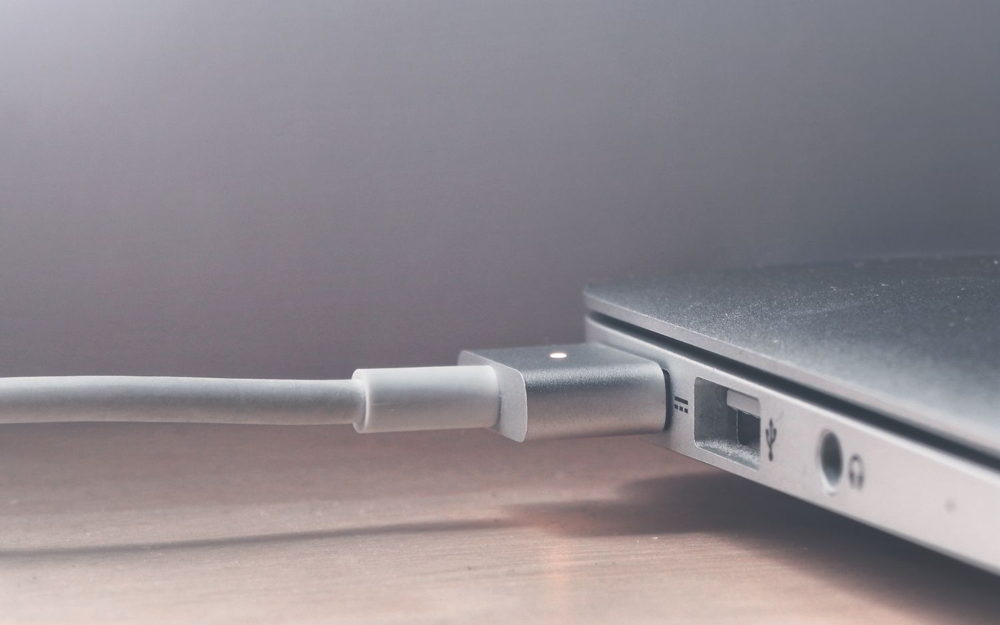

#playrr.js

A simple jQuery plugin for creating simple, lightweight and effective slideshows. Yes, I know, there are a whole load of slider and slideshow plugins out there, But, hey! It won't stop me from creating one.

###How to use it ?

**Initialization**

Just include the playrr.min.css and playrr.min.js and jQuery  into your awesome website and you're good to go.

    <link rel="stylesheet" type="text/css" href="../dist/playrr.min.css">

And the jQuery and plugin

    
	  <!--the plugin now -->
    

Create a wrapper div with an id name of playrr' and add more divs into it with the class of 'slide' into it. Add you're images in the slide divs.  Just like this

    

    	

    	

    	

    	

    	

    	

    	

    

**Call  the plugin**

Now call the plugin... 

    $('#playrr').playrr();
  
###It comes with some options

| Option Name  | Description                                        | Default | Option     |
|--------------|----------------------------------------------------|---------|------------|
| autoPlay     | When enabled, plays the slideshow automatically    | true    | false      |
| timer        | Sets the timer for the autoPlay method.            | 2000    | time in ms |
| showControls | Constructs the controls for the playrr slideshow.  | true    | false      |
| arrows       | Constructs the navigational arrows.                | true    | false      |

###Notes
It will be an ongoing project. Expect more options like more transition types. 

###Credits
Made by [Haider Ali Khichi](http://www.haidrr.com) in Lahore, Pakistan. It is my first jQuery plugin. So please critique it and pull requests are very welcomed.
